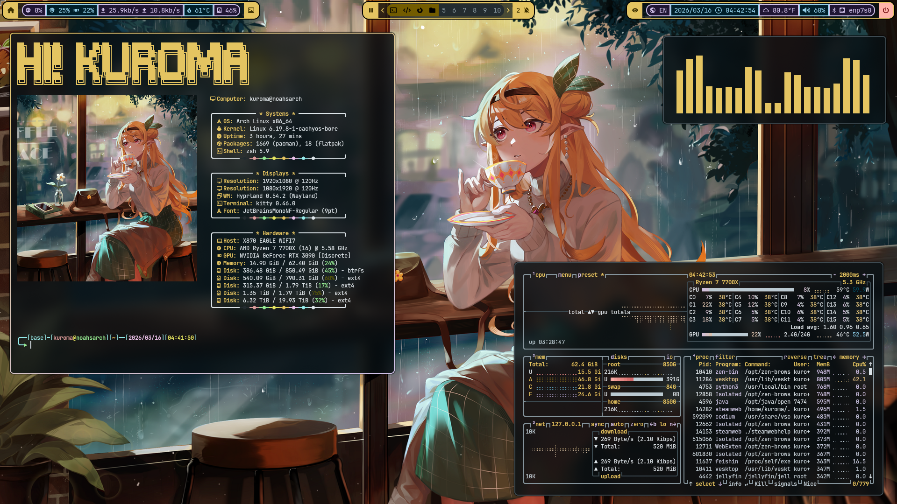
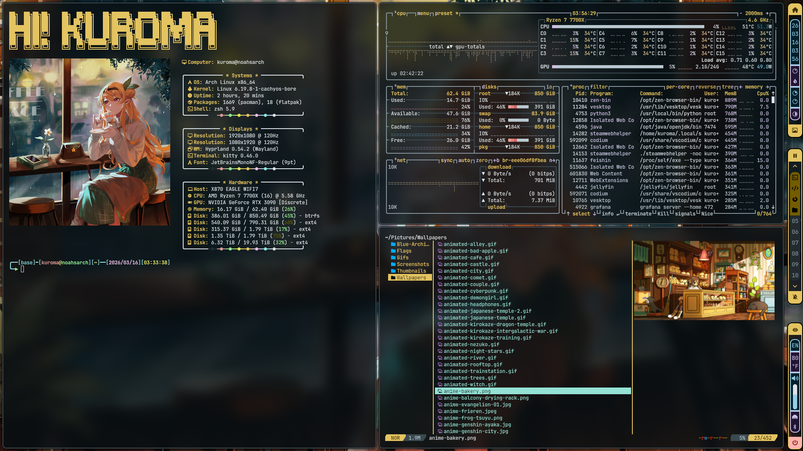
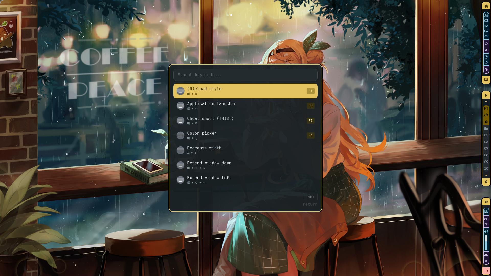
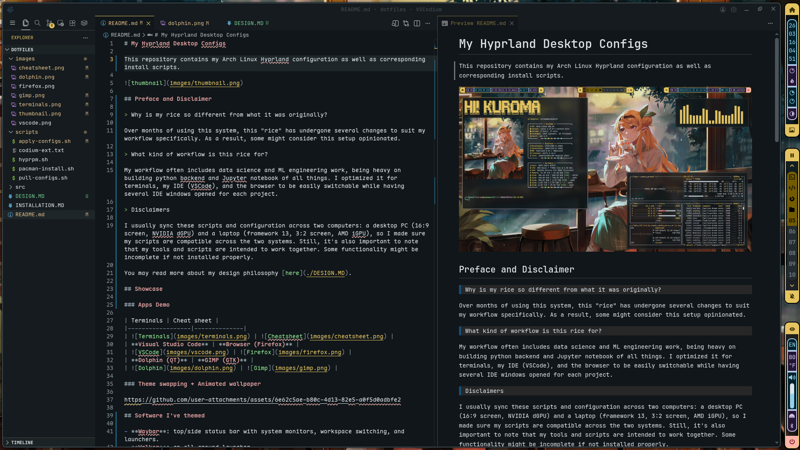
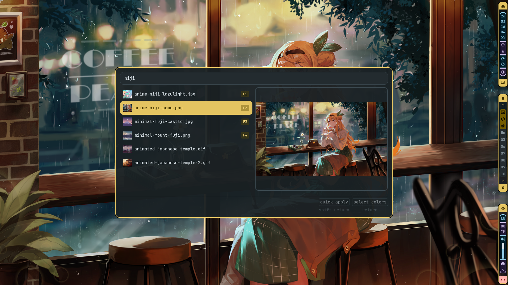
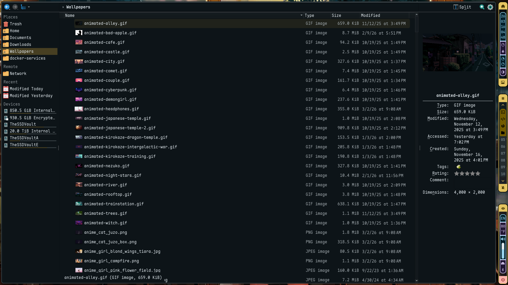
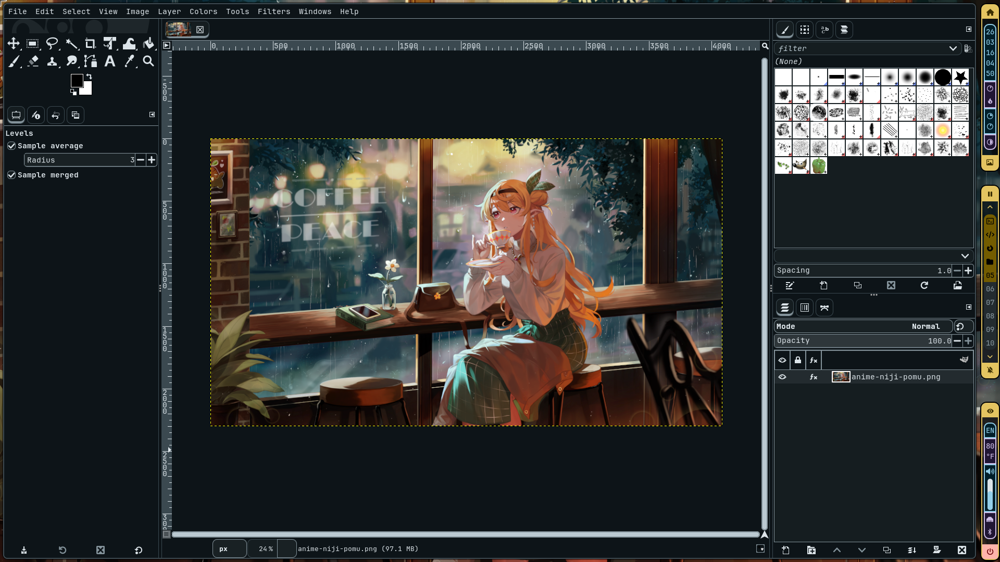

# My Hyprland Desktop Configs

> Unleash upon thee the bloat I have amassed!

This repository contains my Arch Linux Hyprland configuration as well as useful scripts for installation and configuration.

## Preface and Disclaimer

> Why is my rice so different from what it was originally?

Over months of using this system, this "rice" has undergone several changes to suit my workflow specifically. As a result, some might consider this setup opinionated.

> What kind of workflow is this rice for?

My workflow often includes data science and ML engineering work, being heavy on building python backend and Jupyter notebook of all things. I optimized it for terminals, my IDE (VSCode), and the browser to be easily switchable while having several IDE windows opened for each project.

> Firefox was themed, where is it now?

I started using Zen as my primary browser due to its built-in workspace feature and increased privacy over Firefox. As Zen is aesthetically pleasing off-the-box, I didn't feel the need to theme it.

> Disclaimers

I usually sync these scripts and configuration across two computers: a desktop PC (16:9 screen, NVIDIA dGPU) and a laptop (framework 13, 3:2 screen, AMD iGPU), so I made sure my scripts are compatible across the two systems. Still, it's also important to note that my tools and scripts are intended to work together. Some functionality might be incomplete if not installed properly.

You may read more about my design philosophy [here](./DESIGN.MD).

## Showcase

### Apps Demo

| Terminals | Cheat sheet |
|------------------|--------------|
|  |  |
| **Visual Studio Code** | **Wallpaper Selector** |
|  |  |
| **Dolphin (QT)** | **GIMP (GTK)** |
|  |  |

### Theme swapping + Animated wallpaper

https://github.com/user-attachments/assets/6e62c5ae-b80c-4d13-82e5-a0f5d0adbfe2

## Software I've themed/configured

**Press Super+K to access the dynamically generated cheat sheet!**

- **Matugen**: a color palette generator configured to theme every software in this list.
- **Hyprland**: configured the keybinds, animations, and layout rules to support easy layout switching between tiling, scrolling, and monocle.
- **Waybar**: top/side status bar with system monitors, workspace switching, and launchers.
- **Walker**: an all-around launcher and a rofi replacement. Used for my app launchers, wallpaper selector, and almost every menu in quick actions.
- **VSCode**: has an adaptive color scheme albeit loses transparency to reduce distractions.
- **Neovim**: another IDE I themed on top of the default lazyvim config.
- **swww** and **gslapper** to handle regular and animated wallpapers respectively.
- **kitty** and several **TUI apps** like yazi, btop, and cava are themed based on the Ansi colors.
- **GTK/QT** apps are fully themed.
- custom **Fastfetch** menu

## Installation

[OUTDATED, WILL UPDATE SOON] See more at [my installation documentation](./INSTALLATION.MD)

## Known issues

- GTK and QT apps do not not-reload themes and only update on restart.